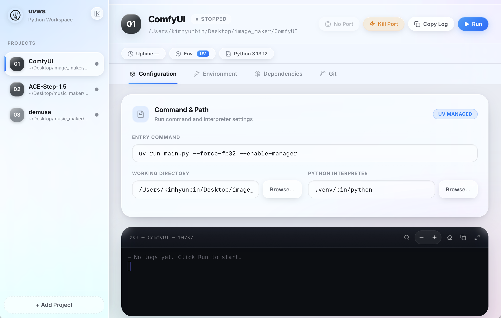

<p align="center">
  
</p>

<h1 align="center">uvws</h1>
<p align="center">
  <strong>The Modern Python Workspace Manager</strong><br/>
  <sub>Register, configure, and launch all your Python projects from a single beautiful desktop app.</sub>
</p>

<p align="center">
  <a href="https://github.com/bunhine0452/uvws/releases"></a>
  
  
  
  
</p>

---

## ✨ Why uvws?

Managing multiple Python projects — each with its own virtual environment, dependencies, and startup scripts — shouldn't be painful. **uvws** brings order to the chaos with a native desktop app that feels like a modern IDE's project dashboard.

| Pain Point | uvws Solution |
|---|---|
| 😩 `cd project && source .venv/bin/activate && python main.py` | **One-click Run** with automatic `uv run` orchestration |
| 😩 Setting up venvs & installing deps manually | **Smart Import Wizard** — auto-detects and initializes `.venv` |
| 😩 Juggling terminal windows for each project | **Built-in Terminal** with real-time log streaming |
| 😩 "What port is this running on again?" | **Auto Port Detection** — opens browser instantly |
| 😩 Zombie processes hogging ports | **Kill Port** — one click to free occupied ports |

---

## 🖼️ Preview

<p align="center">
  
</p>

> A sleek, minimal interface designed for focus. Dark by default. Zero distractions.

---

## 🚀 Features

### 📦 Project Management
- **Register** any Python project by browsing to its directory
- **Configure** entry commands, Python interpreter paths, and environment variables inline
- **Persistent storage** — your project list survives restarts

### ⚡ One-Click Execution
- Wraps every run with `uv run` for seamless virtual environment management
- Auto-creates `.venv` and installs dependencies on first run
- Real-time **stdout/stderr** streaming in an embedded xterm.js terminal

### 🔍 Smart Import Wizard
- Detects existing `requirements.txt` or `pyproject.toml`
- Choose your Python version (3.10 – 3.13)
- Initialize `.venv` and install deps in one step

### 🌐 Port & Process Control
- **Auto-detects** listening ports from log output (`localhost:XXXX`)
- **Open in Browser** button appears when a port is detected
- **Kill Port** — find and terminate processes occupying any port

### 📋 Dependency Inspector
- View all installed packages in `.venv` with version info
- **Sync Now** — re-install from `requirements.txt` / `pyproject.toml`
- Powered by `uv pip list --format json`

---

## 🏗️ Architecture

```
uvws
├── Frontend (React 19 + TypeScript)
│   ├── App.tsx          — Main workspace UI
│   ├── TerminalView     — xterm.js terminal component
│   └── Vite 7           — Dev server & bundler
│
├── Backend (Rust + Tauri 2)
│   ├── runner.rs        — Process lifecycle management
│   ├── config.rs        — JSON-based project persistence
│   ├── uv.rs            — uv CLI integration layer
│   └── lib.rs           — Tauri command handlers
│
└── Platform
    ├── macOS             — .dmg / .app bundle
    └── Windows           — .msi / .exe installer (via CI)
```

**Tech Stack:**

| Layer | Technology |
|---|---|
| Runtime | [Tauri 2](https://tauri.app) (Rust + WebView) |
| Frontend | React 19, TypeScript, Vite 7 |
| Terminal | [xterm.js](https://xtermjs.org) |
| Icons | [Lucide React](https://lucide.dev) |
| Package Manager | [uv](https://docs.astral.sh/uv/) by Astral |
| Process Mgmt | `tokio` async runtime |

---

## 📥 Installation

### Download

Go to the [**Releases**](https://github.com/bunhine0452/uvws/releases) page and download the latest version for your OS:

| Platform | File | Notes |
|---|---|---|
| **macOS** | `uvws_x.x.x_aarch64.dmg` | Apple Silicon (M1/M2/M3/M4) |
| **macOS** | `uvws_x.x.x_x64.dmg` | Intel Mac |
| **Windows** | `uvws_x.x.x_x64-setup.exe` | 64-bit Windows 10+ |

### ⚠️ macOS — First Launch

macOS Gatekeeper may block the app with *"uvws is damaged and can't be opened"* because it is not code-signed with an Apple Developer ID. To fix this:

```bash
# After mounting the .dmg and dragging uvws.app to /Applications:
xattr -cr /Applications/uvws.app
```

Then open the app normally. You only need to do this **once**.

> **Alternative**: Right-click the app → Open → Click "Open" in the dialog.

### Prerequisites

- [**uv**](https://docs.astral.sh/uv/getting-started/installation/) must be installed on your system:
  ```bash
  # macOS / Linux
  curl -LsSf https://astral.sh/uv/install.sh | sh
  
  # Windows (PowerShell)
  powershell -ExecutionPolicy ByPass -c "irm https://astral.sh/uv/install.ps1 | iex"
  ```

---

## 🛠️ Build from Source

### Prerequisites

- [Node.js](https://nodejs.org) 18+
- [pnpm](https://pnpm.io) (recommended) or npm
- [Rust](https://rustup.rs) toolchain (stable)
- [uv](https://docs.astral.sh/uv/)
- Platform-specific Tauri prerequisites — see [Tauri Prerequisites](https://v2.tauri.app/start/prerequisites/)

### Development

```bash
git clone https://github.com/bunhine0452/uvws.git
cd uvws

pnpm install          # Install frontend dependencies
pnpm tauri dev        # Start in development mode
```

### Production Build

```bash
pnpm tauri build      # Build release binaries
```

Build artifacts are in `src-tauri/target/release/bundle/`.

---

## 🗺️ Roadmap

- [x] Core project management (register, configure, delete)
- [x] One-click run with `uv run` orchestration
- [x] Real-time terminal with xterm.js
- [x] Auto port detection & browser open
- [x] Kill port functionality
- [x] Smart Import Wizard with Python version selection
- [x] Dependency inspector & sync
- [ ] Git integration (status, pull, push from UI)
- [ ] Multi-language support (English / Korean)
- [ ] Plugin system for custom workflows
- [ ] Docker container management

---

## 🤝 Contributing

Contributions are welcome! Feel free to:

1. Fork the repository
2. Create a feature branch (`git checkout -b feat/amazing-feature`)
3. Commit your changes (`git commit -m 'feat: add amazing feature'`)
4. Push to the branch (`git push origin feat/amazing-feature`)
5. Open a Pull Request

---

## 📄 License

This project is licensed under the [MIT License](LICENSE).

---

<p align="center">
  Built with ❤️ using <a href="https://tauri.app">Tauri</a> and <a href="https://docs.astral.sh/uv/">uv</a>
</p>
