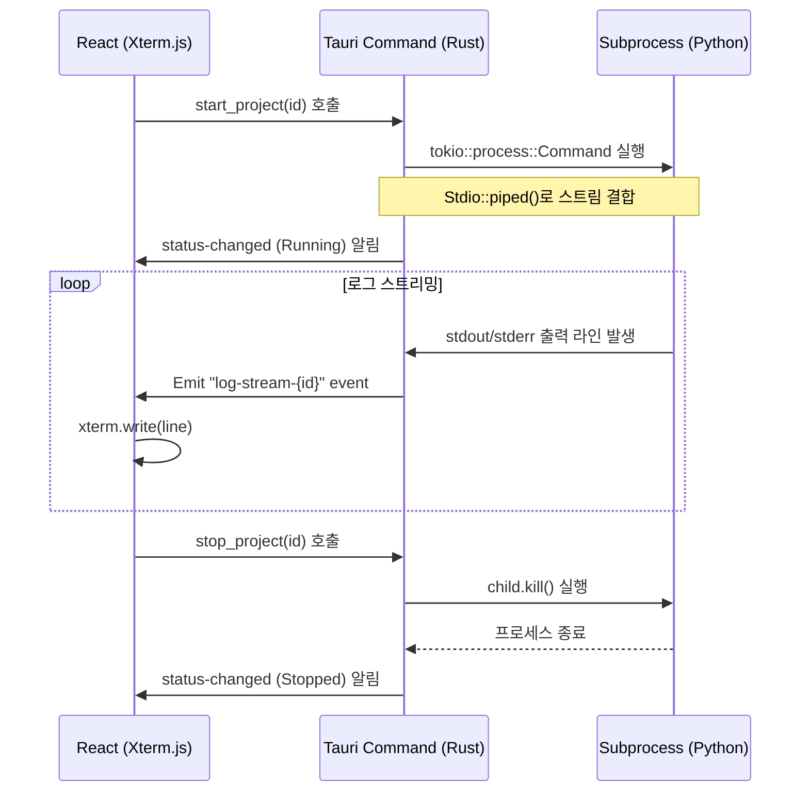

# Phase 2: Rust 프로세스 관리 & 실시간 로그 스트리밍

Phase 2의 목표는 백엔드(Rust)에서 독립된 Python 프로세스를 제어(실행/종료)하고, 프로세스의 실시간 출력(`stdout`, `stderr`)을 프론트엔드로 끊김 없이 송신하여 **Xterm.js** 기반의 가상 터미널에 표시하는 것입니다.

---

## 1. 개발 내용 요약
- **Rust 비동기 프로세스 컨트롤러**: `tokio::process::Command`를 사용하여 로컬 스크립트 실행 및 중지 제어.
- **프로세스 레지스트리**: 실행 중인 프로세스의 핸들과 수명 주기 관리(ID별 강제 종료 시그널 전달).
- **실시간 IPC 로그 스트리밍**: 라인 단위 버퍼 리딩 및 Tauri Window Event 발행.
- **Xterm.js 연동**: 실시간 수신되는 터미널 로그 데이터 출력 및 뷰 포트 오토 스크롤 제어.

---

## 2. 세부 아키텍처 및 구현 코드 예시



### 2.1. [Backend] 프로세스 매니저 및 Command 구현 (`src-tauri/src/runner.rs`)
실행 중인 프로세스의 상태를 추적하고, 프론트엔드의 중지 요청 시 프로세스 트리를 강제 종료하기 위해 `tokio::sync::oneshot` 채널 및 자식 프로세스 핸들을 보관합니다.

```rust
use std::collections::HashMap;
use std::process::Stdio;
use std::sync::{Arc, Mutex};
use tokio::io::{AsyncBufReadExt, BufReader};
use tokio::process::{Child, Command};
use tokio::sync::oneshot;
use tauri::{AppHandle, Emitter};

pub struct RunningProcess {
    pub pid: u32,
    pub kill_tx: oneshot::Sender<()>,
}

#[derive(Default)]
pub struct ProcessRegistry {
    pub active_processes: Mutex<HashMap<String, RunningProcess>>,
}

#[tauri::command]
pub async fn start_project(
    id: String,
    path: String,
    entrypoint: String,
    args: String,
    registry: tauri::State<'_, Arc<ProcessRegistry>>,
    app_handle: AppHandle,
) -> Result<String, String> {
    // 1. 이미 돌고 있는 프로세스가 있는지 검증
    {
        let active = registry.active_processes.lock().unwrap();
        if active.contains_key(&id) {
            return Err("Project is already running".to_string());
        }
    }

    // 2. 실행 커맨드 구성
    // (Phase 3에서 가상환경 uv venv의 python 바이너리 경로로 대체 예정)
    let argument_list: Vec<&str> = args.split_whitespace().collect();
    let mut command = Command::new("python");
    
    command
        .current_dir(&path)
        .arg(&entrypoint)
        .args(&argument_list)
        .stdout(Stdio::piped())
        .stderr(Stdio::piped())
        .kill_on_drop(true);

    // 3. 프로세스 스폰
    let mut child = command.spawn().map_err(|e| format!("Spawn failed: {}", e))?;
    let pid = child.id().ok_or("Failed to get PID")?;
    
    let stdout = child.stdout.take().ok_or("Failed to open stdout")?;
    let stderr = child.stderr.take().ok_or("Failed to open stderr")?;
    
    let (kill_tx, kill_rx) = oneshot::channel::<()>();

    // 4. 레지스트리에 보관
    {
        let mut active = registry.active_processes.lock().unwrap();
        active.insert(id.clone(), RunningProcess { pid, kill_tx });
    }

    // 상태 변경 이벤트 발송
    app_handle.emit(&format!("status-changed-{}", id), "Running").ok();

    // 5. 비동기 로그 모니터링 & 생명주기 루프 구동
    let app_clone = app_handle.clone();
    let id_clone = id.clone();
    let registry_clone = Arc::clone(&registry);

    tokio::spawn(async move {
        let mut stdout_reader = BufReader::new(stdout).lines();
        let mut stderr_reader = BufReader::new(stderr).lines();
        
        let id_for_loop = id_clone.clone();
        let app_for_loop = app_clone.clone();

        // stdout 읽기 루프
        let stdout_handle = tokio::spawn(async move {
            while let Ok(Some(line)) = stdout_reader.next_line().await {
                // ANSI 이스케이프 포맷을 터미널이 인식할 수 있도록 전송
                app_for_loop.emit(&format!("log-stream-{}", id_for_loop), format!("{}\r\n", line)).ok();
            }
        });

        // stderr 읽기 루프
        let id_for_err = id_clone.clone();
        let app_for_err = app_clone.clone();
        let stderr_handle = tokio::spawn(async move {
            while let Ok(Some(line)) = stderr_reader.next_line().await {
                app_for_err.emit(&format!("log-stream-{}", id_for_err), format!("\x1b[31m{}\x1b[0m\r\n", line)).ok(); // 빨간색 강조
            }
        });

        // 프로세스 대기 및 종료 감지
        tokio::select! {
            // 프로세스가 스스로 정상/비정상 종료된 경우
            status = child.wait() => {
                match status {
                    Ok(exit_status) => {
                        let exit_msg = format!("\r\n[PySpace] Process exited with status: {}\r\n", exit_status);
                        app_clone.emit(&format!("log-stream-{}", id_clone), exit_msg).ok();
                    }
                    Err(e) => {
                        let err_msg = format!("\r\n[PySpace] Error waiting for process: {}\r\n", e);
                        app_clone.emit(&format!("log-stream-{}", id_clone), err_msg).ok();
                    }
                }
            }
            // 프론트엔드에서 강제 종료 시그널(Stop)을 수신한 경우
            _ = kill_rx => {
                let _ = child.kill().await;
                app_clone.emit(&format!("log-stream-{}", id_clone), "\r\n[PySpace] Process terminated by user.\r\n").ok();
            }
        }

        // 스트림 타스크 정리
        stdout_handle.abort();
        stderr_handle.abort();

        // 레지스트리에서 제거 및 종료 상태 전달
        {
            let mut active = registry_clone.active_processes.lock().unwrap();
            active.remove(&id_clone);
        }
        app_clone.emit(&format!("status-changed-{}", id_clone), "Stopped").ok();
    });

    Ok(format!("Successfully started with PID: {}", pid))
}

#[tauri::command]
pub async fn stop_project(
    id: String,
    registry: tauri::State<'_, Arc<ProcessRegistry>>,
) -> Result<String, String> {
    let mut active = registry.active_processes.lock().unwrap();
    if let Some(process) = active.remove(&id) {
        // oneshot 채널을 통해 kill 시그널 전송
        let _ = process.kill_tx.send(());
        Ok("Termination signal sent".to_string())
    } else {
        Err("Process is not running".to_string())
    }
}
