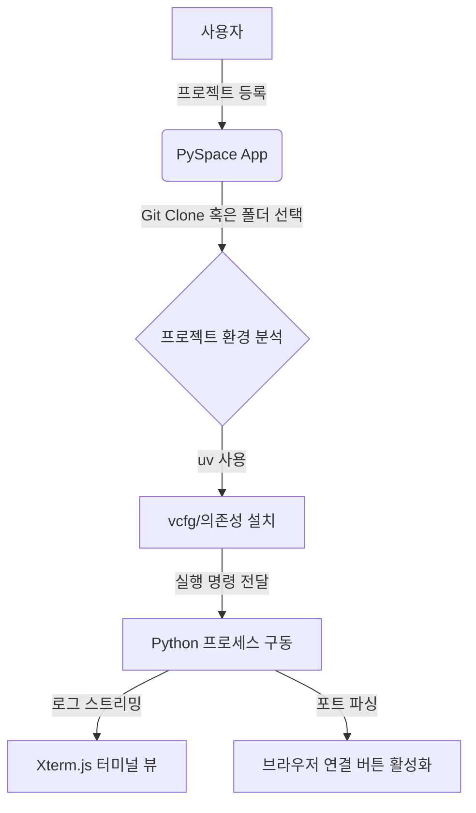

# PySpace Alpha 개발 계획서 (Implementation Plan)

본 문서는 `프로젝트_스크래치.md`에 기재된 아이디어를 바탕으로, 로컬 AI 프로젝트 및 Python 프로젝트들을 `uv` 패키지 매니저 기반으로 쉽게 관리하고 실행할 수 있는 macOS/Windows 데스크톱 애플리케이션 **PySpace**의 상세 설계 및 개발 계획을 정의합니다.

---

## 1. 프로젝트 개요 (Overview)

### 1.1. 동기 및 배경
- **현황**: ComfyUI, ACE-Step-1.5 등 로컬 환경에서 다양한 AI 및 음악 생성 프로젝트를 실행할 때마다 매번 터미널을 열고, 올바른 가상환경을 활성화하며, 의존성을 체크하고, 특정 포트로 브라우저를 접속하는 일련의 과정이 번거롭습니다.
- **해결책**: 신속하고 강력한 Python 패키지 매니저인 `uv`를 활용하여, 프로젝트 등록부터 가상환경 구성, 의존성 설치, 실행 및 터미널 로그 확인, 포트 감지까지 마우스 클릭 몇 번으로 처리할 수 있는 경량 데스크톱 앱을 구축합니다.

### 1.2. 핵심 가치 (Core Values)
1. **경량화 및 속도**: 복잡하고 무거운 기능 배제, 실행 속도 극대화.
2. **실용적인 UX**: 화려함보다 작업 흐름을 끊지 않는 편리함과 직관성에 중점.
3. **가시성**: 백엔드 실행 터미널 로그의 실시간 모니터링 제공.
4. **포트 탐지**: 실행된 웹 서비스의 포트를 자동으로 감지하여 브라우저 원클릭 이동 지원.

---

## 2. 기술 스택 선정 (Tech Stack)

| 구분 | 기술 스택 | 선정 이유 |
| :--- | :--- | :--- |
| **데스크톱 프레임워크** | **Tauri (v2)** | - Rust 기반으로 리소스 소모가 적고 패키지 크기가 작음 (Electron 대비 월등히 가벼움).<br>- macOS 및 Windows 크로스 플랫폼 빌드 완벽 지원.<br>- 시스템 명령(의존성 설치, 프로세스 제어)을 Rust 백엔드에서 안전하고 신속하게 처리 가능. |
| **프론트엔드 프레임워크** | **React + TypeScript** | - 상태 관리 및 UI 컴포넌트 생태계가 풍부함.<br>- 엄격한 타입 정의를 통한 안정적인 개발. |
| **스타일링** | **Vanilla CSS + Modern Layout** | - 프레임워크 의존성을 줄이고 세밀한 테마 및 애니메이션 제어.<br>- 디바이스 성능에 악영향을 주지 않는 경량 스타일링. |
| **터미널 에뮬레이터** | **Xterm.js** | - 웹뷰 내에서 실시간 터미널 로그를 가장 자연스럽고 최적화된 성능으로 출력 가능.<br>- ANSI 컬러 코드 해석 지원. |
| **핵심 유틸리티** | **uv** | - 기존 `pip`, `poetry` 대비 압도적인 가상환경 구축 및 패키지 설치 속도 제공. |

---

## 3. 주요 기능 명세 (Feature Specifications)



### 3.1. 프로젝트 등록 및 관리
- **로컬 디렉토리 가져오기**: 사용자가 로컬에 이미 준비된 프로젝트 폴더를 드래그 앤 드롭하거나 탐색기(`Tauri Dialog`)로 선택하여 등록.
- **Git Clone 등록**: Git Repository URL을 입력하면 PySpace가 지정된 작업 디렉토리 하위에 복제 후 관리 목록에 추가.
- **프로젝트 메타데이터**:
  - 이름, 경로, 설명, 실행 파일명(기본값: `main.py` 또는 `app.py`), 실행 Argument, 환경 변수(ENV) 설정.

### 3.2. `uv` 기반 가상환경 자동 구축
- **환경 감지**: 등록된 디렉토리에 `.venv` 가상환경이 존재하는지 확인.
- **가상환경 생성**: `.venv`가 없는 경우 백엔드에서 `uv venv` 명령어 자동 수행.
- **의존성 설치**: 
  - `requirements.txt` 또는 `pyproject.toml` 감지 시 `uv pip install -r requirements.txt` 혹은 `uv sync` 자동 실행.
  - UI 상에 "의존성 재설치(Reinstall)" 버튼 제공.

### 3.3. 프로세스 생명주기 제어 (Run & Stop)
- Rust의 `tokio::process::Command`를 사용하여 하위 프로세스(Subprocess)를 비동기로 실행 및 관리.
- **상태 관리**:
  - `Stopped` (정지됨)
  - `Installing` (의존성 설치 중)
  - `Running` (실행 중)
  - `Error` (실행 실패 / 비정상 종료)
- 백엔드 프로세스가 실행되는 동안 PID(Process ID)를 트래킹하여 사용자가 "Stop" 버튼을 누르면 자식 프로세스 트리를 안전하게 종료(`Process Kill`).

### 3.4. 실시간 터미널 로그 모니터링
- 하위 프로세스의 `stdout`과 `stderr` 버퍼를 비동기 스트림으로 읽어 옴.
- Tauri Event IPC를 사용하여 로그 데이터를 프론트엔드로 실시간 송신 (`window.emit("log-data", data)`).
- 프론트엔드의 **Xterm.js** 컴포넌트가 버퍼를 수신하여 터미널처럼 출력. ANSI 탈출 시퀀스를 해석하여 Python의 다양한 로그 컬러(예: Rich, Streamlit 로그 등) 지원.

### 3.5. 포트 감지 및 연결
- **로그 분석**: 실시간 로그 스트림에서 `http://localhost:포트`, `http://127.0.0.1:포트` 형태의 정규식 매칭을 수행하여 실행 포트를 동적으로 분석.
- **네트워크 스캔 (선택적)**: 프로세스가 열고 있는 로컬 포트를 OS API(또는 `sysinfo`나 `lsof` 유사 메커니즘)를 통해 보조적으로 감지.
- **UI 반응**: 포트가 감지되면 "Open in Browser" 버튼이 활성화되며, 클릭 시 사용자 기본 브라우저로 해당 주소 자동 오픈.

---

## 4. 시스템 아키텍처 및 데이터 흐름

### 4.1. 데이터 모델 (설정 파일 구조)
애플리케이션 설정 및 등록된 프로젝트 목록은 사용자 앱 데이터 디렉토리에 `config.json` 형태로 저장됩니다.

```json
{
  "settings": {
    "default_workspace": "/Users/kimhyunbin/PySpaceProjects",
    "theme": "dark"
  },
  "projects": [
    {
      "id": "uuid-1234-5678",
      "name": "ComfyUI",
      "path": "/Users/kimhyunbin/Desktop/git/ComfyUI",
      "git_url": "https://github.com/comfyanonymous/ComfyUI.git",
      "entrypoint": "main.py",
      "args": "--listen 127.0.0.1 --port 8188",
      "env": {
        "PYTHONUNBUFFERED": "1"
      },
      "detected_port": 8188,
      "status": "Stopped"
    }
  ]
]
```

### 4.2. 백엔드(Rust)와 프론트엔드(React) 통신 인터페이스

#### Tauri Commands (Frontend -> Backend)
- `add_project(name, path, git_url)`: 새 프로젝트 등록 및 Git Clone 요청.
- `start_project(id)`: 지정 프로젝트의 `uv run python <entrypoint> <args>` 실행 지시.
- `stop_project(id)`: 해당 프로세스 트리 강제 종료.
- `install_dependencies(id)`: `uv pip install` 실행 지시.
- `delete_project(id)`: 프로젝트 설정 제거 (폴더 삭제 여부 선택).

#### Tauri Events (Backend -> Frontend)
- `log-stream-{id}`: 실시간 터미널 출력 데이터 전송.
- `status-changed-{id}`: 프로젝트 상태 변경 알림 (`Running`, `Stopped` 등).
- `port-detected-{id}`: 실행 포트 확인 알림.

---

## 5. UI/UX 디자인 컨셉

> **컨셉**: **"Clean Developer Dashboard"**
> 화려한 장식보다는 블랙/다크 그레이톤의 미니멀 인터페이스에 강렬한 액센트 컬러(예: Neon Green/Cyan)를 적용해 실용성을 강조합니다.

1. **사이드바 (Sidebar)**
   - 등록된 프로젝트 목록이 세로로 나열됨.
   - 프로젝트 상태에 따른 인디케이터 아이콘 표시 (녹색: Running, 회색: Stopped, 황색: Work-in-progress/Installing).
   - 하단에 "새 프로젝트 추가 (+)" 버튼 배치.
2. **메인 영역 (Main Panel)**
   - **상단 헤더**: 현재 선택된 프로젝트 명, 상태 표시, 실행/중지 토글 버튼, 브라우저 열기 버튼.
   - **설정 토글 영역**: 접이식 패널로 구현하여 평소에는 가리고 실행 파라미터나 환경 변수를 고칠 때만 열어봄.
   - **터미널 영역 (Terminal Panel)**:
     - 메인 영역의 70% 이상을 차지하는 Xterm.js 기반 블랙 터미널 화면.
     - "자동 스크롤 활성화/비활성화", "로그 비우기(Clear)" 버튼 지원.
     - 텍스트 검색(포트 또는 에러 검색용) 입력창 탑재.

---

## 6. 개발 로드맵 (Roadmap)

### Phase 1: 기반 다지기 및 Tauri 환경 구축
- Tauri v2 + React 프로젝트 구조 설정.
- 사용자 설정 저장소(`config.json`) 및 기본 CRUD 구현.
- UI 와이어프레임 설계 (사이드바 및 메인 대시보드 기본 배치).

### Phase 2: Rust 프로세스 관리 & 실시간 로그 스트리밍
- `tokio::process::Command`를 통한 백엔드 프로세스 핸들러 구현.
- 프로세스 `stdout`/`stderr` 버퍼 리딩 및 Tauri Event 전송 로직 작성.
- 프론트엔드에 Xterm.js 적용 및 실시간 로그 스트리밍 표출 검증.

### Phase 3: uv 연동 및 포트 감지 자동화
- `uv` 설치 여부 체크 및 미설치 시 가이드 제공.
- `uv venv` 생성 및 의존성 분석/설치 자동화 커맨드 오케스트레이션.
- 로그 스트림 파싱 엔진 및 포트 감지 매커니즘 구현.

### Phase 4: 폴리싱 & 크로스 플랫폼 배포
- 실행 예외 처리 강화 (예: 포트 충돌 대처, 비정상 종료 시 자동 재시작 옵션).
- UI/UX 디테일 개선 (트랜지션 애니메이션, 다크모드 전용 테마 정교화).
- macOS용 `.dmg` 빌드 및 Windows용 `.msi` 빌드 구성.
- 1차 알파 릴리즈 배포.
